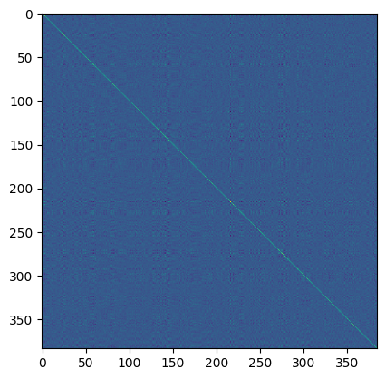

# Distance Metrics tests 

First encode the targest and sources artifacts. 
Run `data_processors.sentence_encoding.py`, it defaults to the `ultilingual-e5-small` pretrained model

___

### Load embeddings from index-matched sources and targets


```python
import pickle

with open('../lib/artifacts/dicts/sources_emb.pickle', 'rb') as handle:
    sources_dict = pickle.load(handle)
with open('../lib/artifacts/dicts/targets_emb.pickle', 'rb') as handle:
    targets_dict = pickle.load(handle)
```


```python
import numpy as np
sources_emb = np.array([v for v in sources_dict.values()])
targets_emb = np.array([v for v in targets_dict.values()])
```


```python
import sys
sys.path.insert(0, '..') # add parent folder path
```


```python
from time import time
from tqdm import tqdm
import faiss
from distance_metrics import batch_compute_distances, batch_compute_kd_trees, evaluate_index_matched_results

metrics = {
           "Inner Product L2": faiss.METRIC_INNER_PRODUCT, 
           "L2": faiss.METRIC_L2, # Squared Euclidean
           "L1": faiss.METRIC_L1, # Manhatan
           "Linf": faiss.METRIC_Linf, # infinity distance
           "Camberra": faiss.METRIC_Canberra,
           # "Jaccard": faiss.METRIC_Jaccard, # NOTE: This is not working properly I still am not sure why
           "HNSWFlat": "HNSWFlat", # Not exhaustive  
           "KD-Trees": "KD-Trees"
}

results_dict = []

for m, metric in tqdm(metrics.items(), desc="Evaluating available metrics"):

    # Track results
    top1 = 0
    top5 = 0
    top10 = 0
    total = len(sources_emb)

    # Track Encoding Time
    start = time()

    # Compute distances
    if metric == "KD-Trees":
        distance, index = batch_compute_kd_trees(feature_space=targets_emb, query=sources_emb, k=10)
    else: distance, index = batch_compute_distances(targets_emb, sources_emb, metric, k=10)

    # Compute time
    end = time()
    elapsed_seconds = end - start

    # Evaluate results
    evaluate = evaluate_index_matched_results(index)
    evaluate['metric'] = m
    evaluate['n_tests'] = total
    evaluate['elapsed_seconds'] = elapsed_seconds
    evaluate['preds_per_second_X1000'] = total/elapsed_seconds/1000

    results_dict.append(
        evaluate
    )
```

    Evaluating available metrics:   0%|          | 0/7 [00:00<?, ?it/s]

    Evaluating available metrics:  14%|█▍        | 1/7 [00:00<00:01,  5.35it/s]

    normalizing


    Evaluating available metrics:  71%|███████▏  | 5/7 [00:00<00:00,  5.60it/s]

    HNSWFlat


    Evaluating available metrics: 100%|██████████| 7/7 [00:04<00:00,  1.63it/s]


```python
import pandas as pd
results_df = pd.DataFrame.from_dict(results_dict)
results_df.sort_values(by=['top1', 'top5', 'top10'], ascending=False)
```


<div>
<style scoped>
    .dataframe tbody tr th:only-of-type {
        vertical-align: middle;
    }

    .dataframe tbody tr th {
        vertical-align: top;
    }

    .dataframe thead th {
        text-align: right;
    }
</style>
<table border="1" class="dataframe">
  <thead>
    <tr style="text-align: right;">
      <th></th>
      <th>top1</th>
      <th>top5</th>
      <th>top10</th>
      <th>metric</th>
      <th>n_tests</th>
      <th>elapsed_seconds</th>
      <th>preds_per_second_X1000</th>
    </tr>
  </thead>
  <tbody>
    <tr>
      <th>0</th>
      <td>0.472097</td>
      <td>0.718272</td>
      <td>0.780378</td>
      <td>Inner Product L2</td>
      <td>2222</td>
      <td>0.180036</td>
      <td>12.341971</td>
    </tr>
    <tr>
      <th>6</th>
      <td>0.469847</td>
      <td>0.716022</td>
      <td>0.781728</td>
      <td>KD-Trees</td>
      <td>2222</td>
      <td>3.266576</td>
      <td>0.680223</td>
    </tr>
    <tr>
      <th>2</th>
      <td>0.468947</td>
      <td>0.711971</td>
      <td>0.770927</td>
      <td>L1</td>
      <td>2222</td>
      <td>0.219857</td>
      <td>10.106559</td>
    </tr>
    <tr>
      <th>1</th>
      <td>0.467597</td>
      <td>0.716472</td>
      <td>0.780378</td>
      <td>L2</td>
      <td>2222</td>
      <td>0.176964</td>
      <td>12.556240</td>
    </tr>
    <tr>
      <th>5</th>
      <td>0.467147</td>
      <td>0.717822</td>
      <td>0.781278</td>
      <td>HNSWFlat</td>
      <td>2222</td>
      <td>0.083159</td>
      <td>26.719908</td>
    </tr>
    <tr>
      <th>4</th>
      <td>0.413141</td>
      <td>0.648065</td>
      <td>0.704770</td>
      <td>Camberra</td>
      <td>2222</td>
      <td>0.161408</td>
      <td>13.766361</td>
    </tr>
    <tr>
      <th>3</th>
      <td>0.277228</td>
      <td>0.447345</td>
      <td>0.498200</td>
      <td>Linf</td>
      <td>2222</td>
      <td>0.143384</td>
      <td>15.496824</td>
    </tr>
  </tbody>
</table>
</div>


```python
from utils.plotting import parallel
```


```python
results_df.drop(['n_tests'], axis=1, inplace=True)
```


```python
parallel(results_df, label='metric')
```


# Other metrics

## Mahalanobis


```python
import numpy as np
import faiss
from matplotlib import pyplot as plt

stacked = np.vstack([sources_emb, targets_emb])
```


```python
# compute and visualize the covariance matrix
xc = targets_emb - targets_emb.mean(0)
cov = np.dot(xc.T, xc) / xc.shape[0]
_ = plt.imshow(cov)
```


    

    


```python
cov
```


    array([[ 3.8286968e-04, -9.9552835e-06,  1.1587883e-07, ...,
            -4.3315598e-05, -3.3048760e-05, -1.5565009e-05],
           [-9.9552835e-06,  4.8848649e-04,  1.2768770e-05, ...,
             5.4477761e-05,  1.0735298e-04,  8.0193291e-05],
           [ 1.1587883e-07,  1.2768770e-05,  3.2220045e-04, ...,
             6.3375614e-05, -1.4427606e-05,  2.4960971e-05],
           ...,
           [-4.3315598e-05,  5.4477761e-05,  6.3375614e-05, ...,
             4.8934313e-04,  1.0738263e-05, -2.3427783e-06],
           [-3.3048760e-05,  1.0735298e-04, -1.4427606e-05, ...,
             1.0738263e-05,  4.9229956e-04,  8.6209562e-05],
           [-1.5565009e-05,  8.0193291e-05,  2.4960971e-05, ...,
            -2.3427783e-06,  8.6209562e-05,  4.1356968e-04]], dtype=float32)


```python
# map the vectors back to a space where they follow a unit Gaussian
L = np.linalg.cholesky(cov)
mahalanobis_transform = np.linalg.inv(L)
y = np.dot(stacked, mahalanobis_transform.T)
```


    ---------------------------------------------------------------------------

    LinAlgError                               Traceback (most recent call last)

    Cell In[12], line 2
          1 # map the vectors back to a space where they follow a unit Gaussian
    ----> 2 L = np.linalg.cholesky(cov)
          3 mahalanobis_transform = np.linalg.inv(L)
          4 y = np.dot(stacked, mahalanobis_transform.T)


    File /opt/miniconda3/envs/vocab/lib/python3.12/site-packages/numpy/linalg/linalg.py:779, in cholesky(a)
        777 t, result_t = _commonType(a)
        778 signature = 'D->D' if isComplexType(t) else 'd->d'
    --> 779 r = gufunc(a, signature=signature, extobj=extobj)
        780 return wrap(r.astype(result_t, copy=False))


    File /opt/miniconda3/envs/vocab/lib/python3.12/site-packages/numpy/linalg/linalg.py:115, in _raise_linalgerror_nonposdef(err, flag)
        114 def _raise_linalgerror_nonposdef(err, flag):
    --> 115     raise LinAlgError("Matrix is not positive definite")


    LinAlgError: Matrix is not positive definite


The matrix is singular, according to the solver. That means a zero or near-zero diagonal element, so inversion is impossible...

## JensenShannon


```python
distance, index = batch_compute_distances(targets_emb, sources_emb, faiss.METRIC_Jaccard, k=targets_emb.shape[0])
```


```python
index[:5]
```


    array([[1384,  512,  215, ..., 1789, 1845, 1620],
           [1384,  215,  690, ...,  403, 1890, 1620],
           [1384,  690,  215, ...,  370, 1890,  403],
           [1384,  215,  690, ..., 1890,  403, 1625],
           [1384,  215,  690, ..., 1890,  403, 1625]])


```python
index = faiss.index_factory(
    targets_emb.shape[1], "HNSW", faiss.METRIC_L2)
index.add(targets_emb)
distance, index = index.search(sources_emb, k=10)
```


```python
index
```


    array([[ 955,  367, 1092, ..., 2023,  890, 1470],
           [  15,   18,   19, ...,   13,    2,   12],
           [  13,  247,  248, ...,    3,    7,   10],
           ...,
           [2219, 2202, 2096, ..., 2100, 2174, 2217],
           [2152, 2146, 2220, ..., 2210, 2172, 2098],
           [2221,  223, 1319, ...,  988,  639, 1288]])


```python
evaluate_index_matched_results(index)
```


    {'top1': 0.4063906390639064,
     'top5': 0.6129612961296129,
     'top10': 0.6642664266426642}


This one has poorer performance and will be discarded

# HNSW - Hierarchical Navigable Small Worlds

The Hierarchical Navigable Small World indexing method is based on a graph built on the indexed vectors. At search time, the graph is explored in a way that converges to the nearest neighbors as quickly as possible.


- M is the number of neighbors used in the graph. A larger M is more accurate but uses more memory
- efConstruction is the depth of exploration at add time
- efSearch is the depth of exploration of the search


All will be using no encoding at all (IndexFlat): the vectors are stored without compression.


```python
M = list(range(20, 400, 50))
efConstruction = list(range(20, 400, 50))
efSearch = list(range(20, 400, 50))

```


```python
import itertools
params = list(itertools.product(*[M, efConstruction, efSearch]))
```


```python
len(params)
```


    512


```python
results = []
for M, efConstruction, efSearch in params:

    index = faiss.IndexHNSWFlat(targets_emb.shape[1], M)
    index.hnsw.efConstruction = efConstruction
    index.hnsw.efSearch = efSearch
    index.add(targets_emb)
    distance, index = index.search(sources_emb, k=10)

    eval = evaluate_index_matched_results(index)
    eval['M'] = M
    eval['efConstruction'] = efConstruction
    eval['efSearch'] = efSearch

    results.append(eval)
```


```python
import pandas as pd
results_df = pd.DataFrame.from_dict(results)
```


```python
results_df.sort_values(by=['top1', 'top5', 'top10'], ascending=False)
```


<div>
<style scoped>
    .dataframe tbody tr th:only-of-type {
        vertical-align: middle;
    }

    .dataframe tbody tr th {
        vertical-align: top;
    }

    .dataframe thead th {
        text-align: right;
    }
</style>
<table border="1" class="dataframe">
  <thead>
    <tr style="text-align: right;">
      <th></th>
      <th>top1</th>
      <th>top5</th>
      <th>top10</th>
      <th>M</th>
      <th>efConstruction</th>
      <th>efSearch</th>
    </tr>
  </thead>
  <tbody>
    <tr>
      <th>314</th>
      <td>0.467147</td>
      <td>0.717822</td>
      <td>0.782628</td>
      <td>220</td>
      <td>370</td>
      <td>120</td>
    </tr>
    <tr>
      <th>78</th>
      <td>0.467147</td>
      <td>0.717822</td>
      <td>0.782178</td>
      <td>70</td>
      <td>70</td>
      <td>320</td>
    </tr>
    <tr>
      <th>119</th>
      <td>0.467147</td>
      <td>0.717822</td>
      <td>0.782178</td>
      <td>70</td>
      <td>320</td>
      <td>370</td>
    </tr>
    <tr>
      <th>79</th>
      <td>0.467147</td>
      <td>0.717822</td>
      <td>0.781728</td>
      <td>70</td>
      <td>70</td>
      <td>370</td>
    </tr>
    <tr>
      <th>171</th>
      <td>0.467147</td>
      <td>0.717822</td>
      <td>0.781728</td>
      <td>120</td>
      <td>270</td>
      <td>170</td>
    </tr>
    <tr>
      <th>...</th>
      <td>...</td>
      <td>...</td>
      <td>...</td>
      <td>...</td>
      <td>...</td>
      <td>...</td>
    </tr>
    <tr>
      <th>8</th>
      <td>0.414041</td>
      <td>0.626463</td>
      <td>0.676418</td>
      <td>20</td>
      <td>70</td>
      <td>20</td>
    </tr>
    <tr>
      <th>384</th>
      <td>0.405491</td>
      <td>0.622412</td>
      <td>0.674617</td>
      <td>320</td>
      <td>20</td>
      <td>20</td>
    </tr>
    <tr>
      <th>128</th>
      <td>0.405041</td>
      <td>0.612961</td>
      <td>0.661116</td>
      <td>120</td>
      <td>20</td>
      <td>20</td>
    </tr>
    <tr>
      <th>64</th>
      <td>0.398290</td>
      <td>0.602160</td>
      <td>0.652565</td>
      <td>70</td>
      <td>20</td>
      <td>20</td>
    </tr>
    <tr>
      <th>0</th>
      <td>0.376688</td>
      <td>0.559856</td>
      <td>0.603060</td>
      <td>20</td>
      <td>20</td>
      <td>20</td>
    </tr>
  </tbody>
</table>
<p>512 rows × 6 columns</p>
</div>


The optimized parameters will be used as default in the implemented method

# KD-Trees

A K-D Tree is a binary tree in which each node represents a k-dimensional point. Every non-leaf node in the tree acts as a hyperplane, dividing the space into two partitions.


```python
from distance_metrics import batch_compute_kd_trees
distance, index = batch_compute_kd_trees(feature_space=targets_emb, query=sources_emb, k=10)
```


```python
index
```


    array([[   0,  955,   18, ...,    1,   10,   20],
           [  18,   15,   19, ...,   13,   14,    2],
           [  13,  367,  247, ...,   10,    3,    7],
           ...,
           [2219, 2202, 2096, ..., 2100, 2174, 2217],
           [2152, 2220, 2146, ..., 2210, 2172, 2098],
           [2221,  223, 1319, ..., 1436,  988, 1288]])


```python
evaluate_index_matched_results(index)
```


    {'top1': 0.46984698469846986,
     'top5': 0.716021602160216,
     'top10': 0.7817281728172817}


# Conclusion

The L2 search of the normalized inner product vectors seems to be the fastest and beste performing distance metric of the bunch.

Furthermore, it is exhaustive, which means it will always reach the best match, unlike tree-based searches. 
